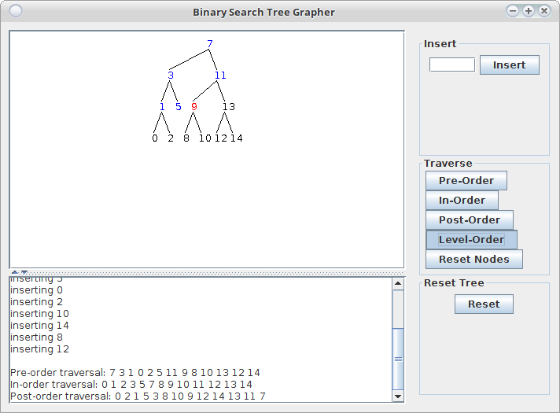

# Binary search tree traversal: a visual demo

> **This project is deprecated and not maintained.**

* **Language:** Java
* **Developed:** 2004

I wrote this during an independent studies course back in 2004.  Part of the course involved
implementing and experimenting with all the basic data structures.  Tree traversals were hard. So I
wrote a visualization app to help me understand the algorithms.


## Usage
```
java -jar visualtree.jar
```



## What's inside
A mini-framework of basic data structures; the visualization app is built on top of it.
