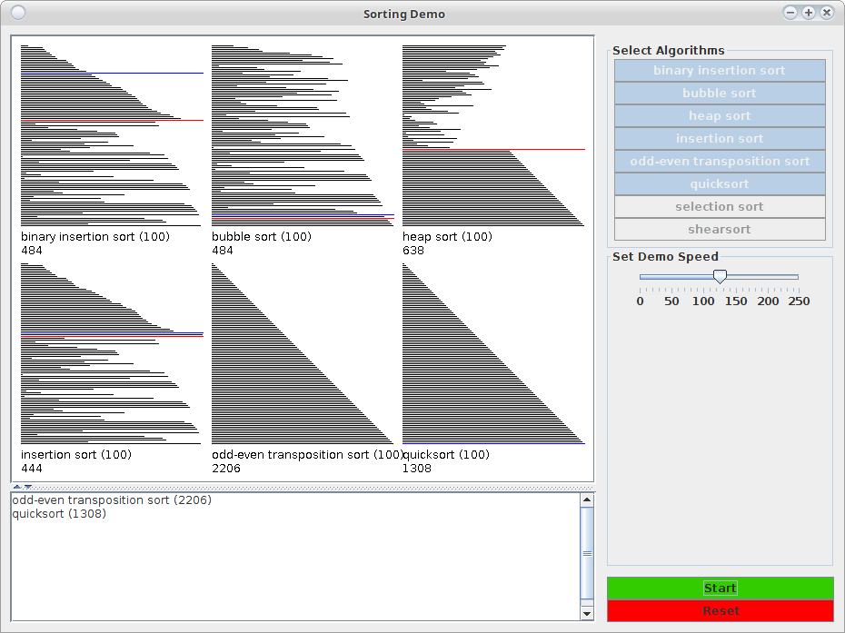

# Sorting algorithms: a visual demo

> **This project is deprecated and not maintained.**

* **Language:** Java
* **Developed:** 2004

I wrote this during an algorithms course back in 2004.
The app displays an approximation of the relative performance of different sorting algorithms. 
The package includes implementations of 8 sorting algorithms (4 of them borrowed). Additional algorithms can be easily
ported.


## Usage
```
java -jar visualsort.jar
```



## Original readme from November 2004

### List of classes

        MainApp
        MainPanel

        SortingDisplay
        LinesSortingDisplay

        ArrayFactory

        Sorter
        SortingAlgorithm

        BinaryInsertionsortAlgorithm (Sergei)
        InsertionsortAlgorithm (Sergei)
        QuicksortAlgorithm (Sergei)
        SelectionsortAlgorithm (Sergei) 
        BubblesortAlgorithm (James Gosling)
        HeapsortAlgorithm (Jason Harrison)
        OddEvenTransortAlgorithm (Andrew Kitchen)
        ShearsortAlgorithm (Andrew Kitchen)
        
### Summary
This app displays an animation of the execution of different sorting algorithms. 

The sorting process is displayed by sorting horizontal lines. This visual 
representation can be changed in a SortingDisplay subclass which must override 
the paintComponent(Graphics g) method.

To port a sorting algorithm:
1. extend the SortingAlgorithm abstract class, implementing the name() 
and sort(int[] array) methods;
2. call the incrementBasicOps() method where the basic operation count must be
incremented;
3. call the animate()/animate(int a)/animate(int a, int b)/animate(int[] a)
methods to animate the sort; the arguments animate the cursors.
4. add the algorithm's class name to the array of strings in MainApp.

Also, you may change the size of the sorted arrays by passing a different # of 
elements from MainApp.

### Remarks
Observation regarding Swing: never call the paintComponent method directly: 
paintComponent(getGraphics()). Instead simply call repaint(). The method to be 
overridden still is paintComponent(Graphics g). The performance improves
dramatically.

One of the not implemented features is selecting a type of the array to create:
random/ascending/descending. All arrays are random. However, the ArrayFactory
class implements the other two types.
