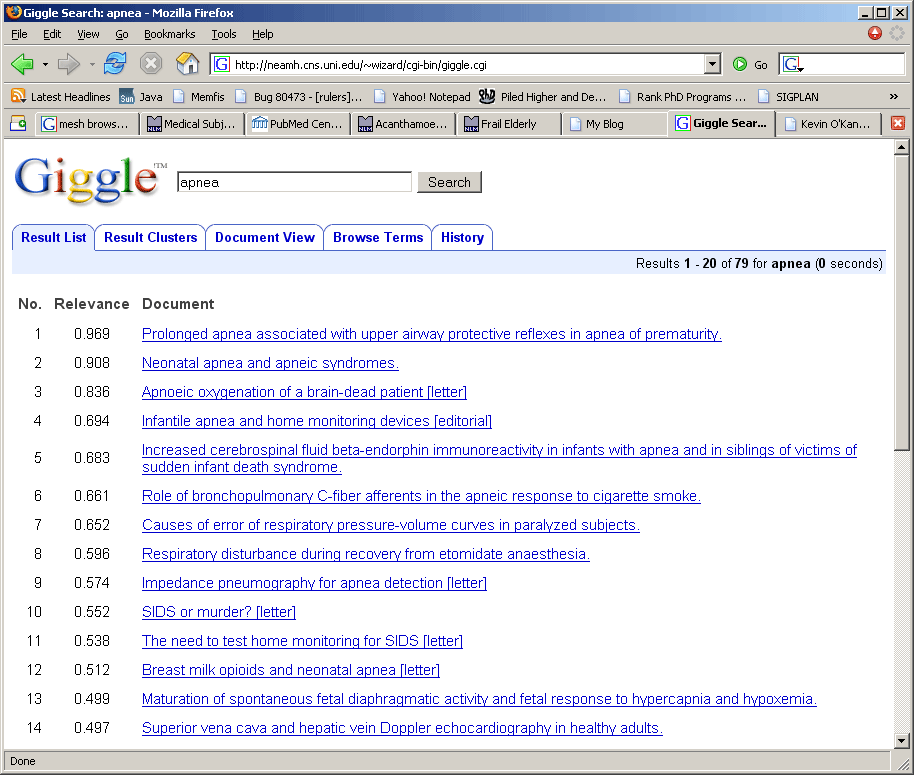
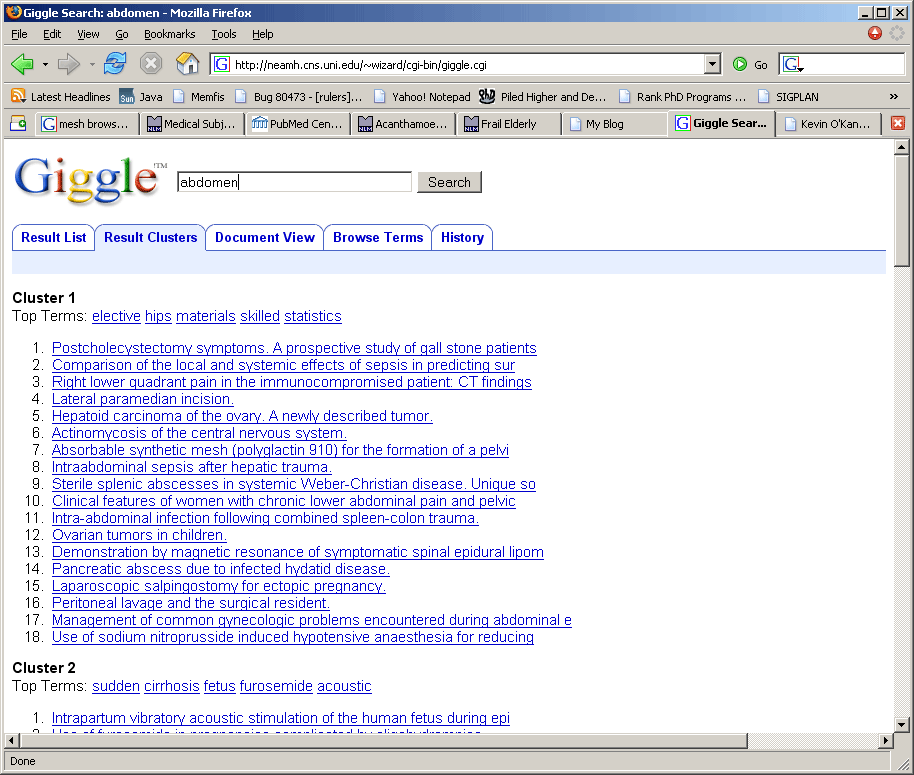
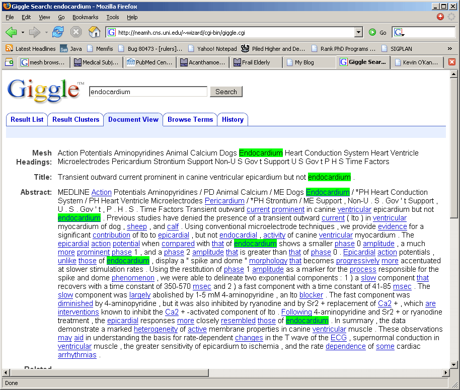
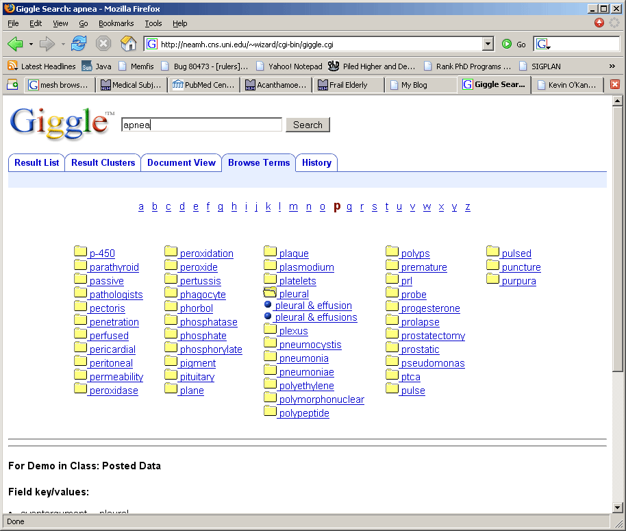
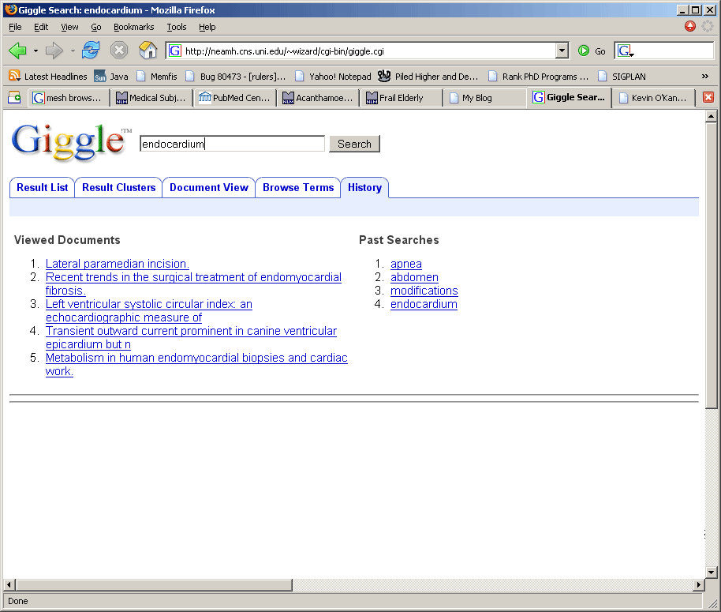

# My first project in information storage and retrieval 

> **This project is deprecated and not maintained.**

**A search/browsing web-based interface for a small subset of the MEDLINE database.** This was my project in information storage and retrieval during grad studies at [UNI](http://faculty.chas.uni.edu/~okane/isr.html), developed together with Alex Stevenson.

* **Technology:** CGI; written in [Mumps](http://faculty.chas.uni.edu/~okane/) (or M), C, JavaScript, and HTML/CSS
* **Developed:** 2005

## Project Description 
This was a basic web-based IR system, minus the indexing. Features included:
* basic search 
* soundex (words that sound like one another translated into common codes)
* document view:
  * highlighted query terms
  * other document terms displayed as links to queries
  * ranked list of related documents
* browsing interface: alphabetically grouped terms expanding to related term combinations
* dynamic clustering: generated clusters using top 100 results identifying most common terms for each cluster
* history view displaying links to previous searches and viewed documents

The view (HTML + JavaScript) was generated dynamically based on user input. The data for alternative views was preserved across the session, although nothing was stored on the server. The state management model was inspired by ASP.NET: the entire web page was treated as a form with persistent data stored and passed in a hidden form field. Browser click events were handled with JavaScript which set the values of 2 other hidden form fields that kept track of the action and the target of the event. 

Why Giggle? Seemed clever at the time. I even added a bang to the TM sign, so it's *not* trademarked..
 

## What's inside
The Mumps source files.

## Screenshots

