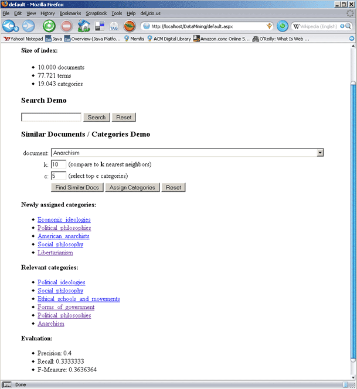

# 	k-NN Wikipedia page classifier

> **This project is deprecated and not maintained.**

**Applying k-nearest neighbors algorithm to classifying Wikipedia pages.** This was my project in a [data mining](http://www.public.asu.edu/~huanliu/DM07S/cse572.html) class during my grad studies at [ASU](https://cidse.engineering.asu.edu).  

* **Technology:** ASP.NET; written in C#
* **Developed:** 2007

## Implementation
The  goal was to explore a text classification algorithm applying domain-specific modifications. 

The system used a set of Wikipedia articles (n = 10,000) with assigned categories (Wikipedia Categories is a manually maintained ontology, at the time of experiment consisting of 19,043 categories). The system executed the following steps:
2. Prepare and index the data
3. Run k-NN algorithm to assign categories to a document
4. Repeat until optimal parameter weights are found: Evaluate results >> change weights >> rerun algorithm

### Algorithm design
k-NN is a lazy learner, which means that it leaves most of the work until the last moment: instead of building a classification model, it organizes the training set and runs a comparison function on an item to be classified only when the item is submitted for classification. For each document in the corpus the system pre-computed the document TF-IDF vector. Then, for each item to be classified, the algorithm computed its (cosine) similarity to each document in the corpus and returned the top k similar documents. It then selected a set of categories from this set of *k* results and assigned the categories which appeared at least *c* times. 

### Data transformation
I downloaded the raw data dumps (thank you, Wikipedia) and parsed them into manageable XML-based format:

```xml
<page>
	<id>42</id>
	<title>Interesting Document</title>
	<text>Fascinating text...</text>
</page>
```

Then, for each set, the system generated:  
* List of document titles
* Existing document/category assignments
* List of categories based on selected assignments

### Data cleaning and feature selection 
The initial number of extracted terms was 382,122. The following was done to reduce the size of the set:
1. Apply a stoplist (this improved accuracy of results, but not the feature set size)
2. Remove terms with digits and special characters
3. Apply Porter stemmer (reduced the set to 320.428 terms)
4. Remove terms occurring in more than 50% of documents (reduced the set to 320.388 terms)
5. Remove terms occurring in 2 documents (reduced the set to 77.721 terms)

### Indexing

The system generated binary and text files for storing:
* Document norms, external IDs, titles
* Term IDFs, term document counts
* Document term vectors, term document vectors
* Categories and document/category assignments, etc...

### Evaluation
The newly assigned categories were compared to the manually assigned categories using precision, recall and their harmonic mean. The weights of k and c were systematically reassigned and the algorithm rerun on multiple combinations of testing documents until the optimal combination was identified (k=50, c=5). The classification results were disappointing, but the designing the system was fun, of course.



## What's inside
All relevant files from VS solution organized into 4 assemblies: data (misc. data structures and data access helpers), index (data loading and indexing utility), console tools (misc. utilities), and website (a demo web page).