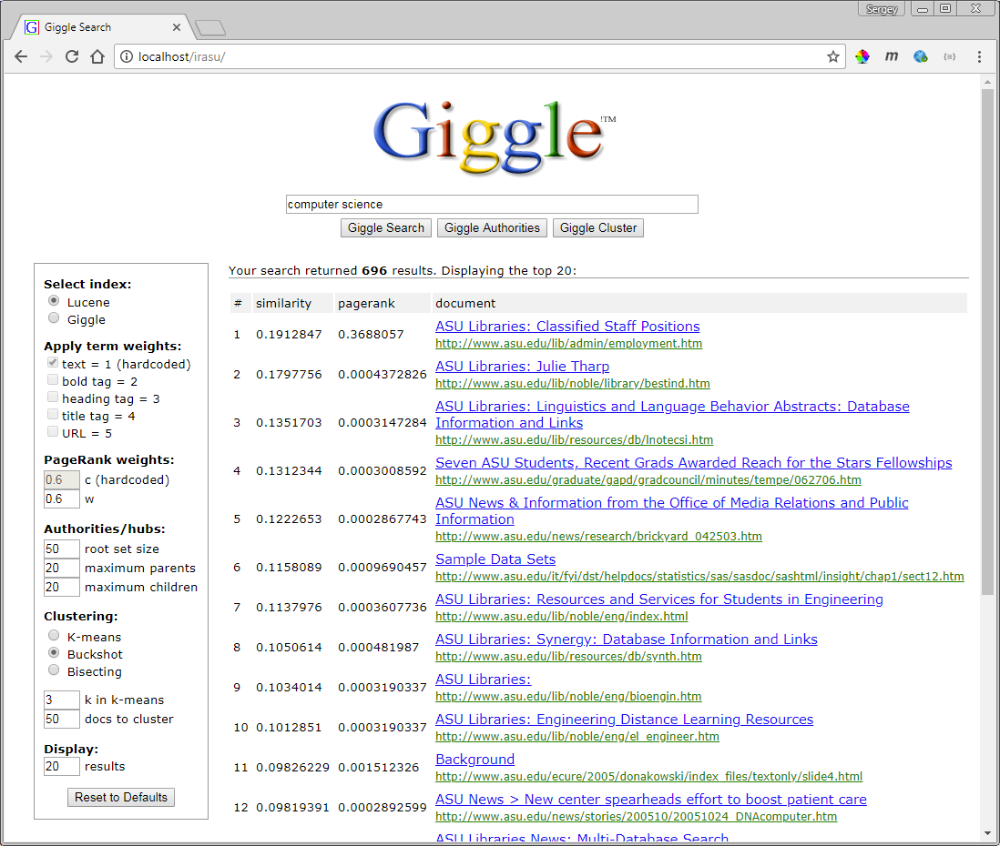
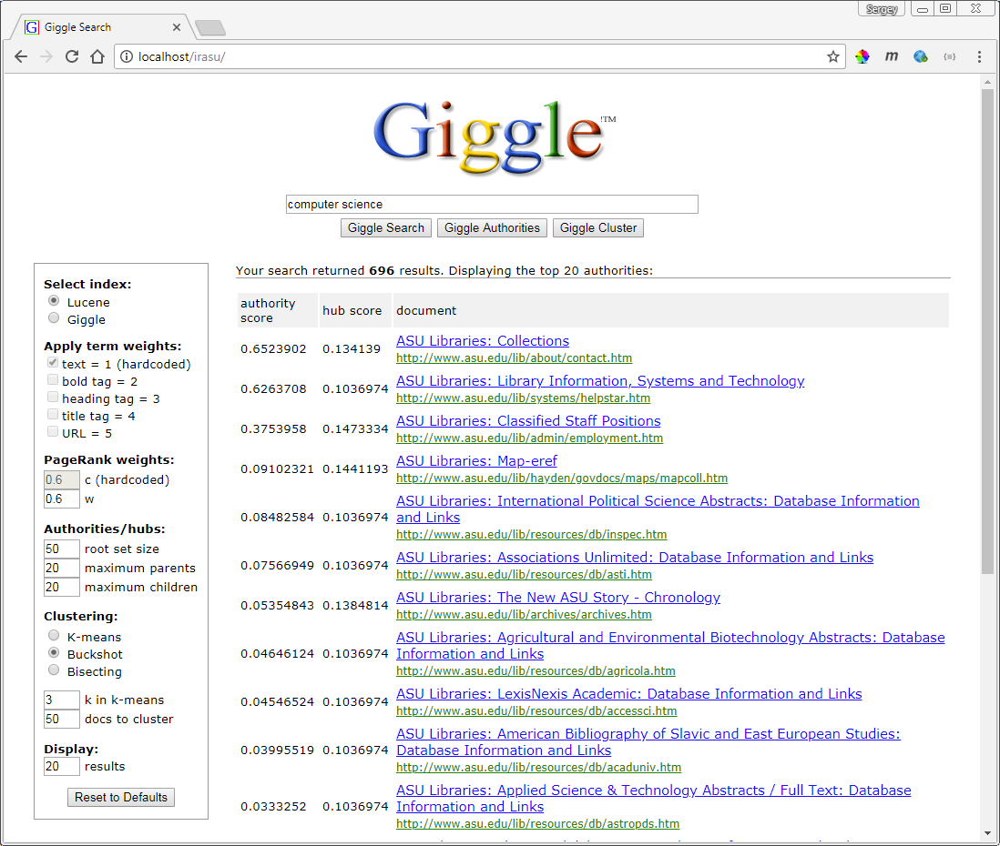

# Experiments with page ranking algorithms

> **This project is deprecated and not maintained.**

**Experiments with PageRank, Hubs and Authorities; and K-Means, Buckshot and Bisecting K-Means clustering algorithms.** This was my project in [information retrieval, mining and integration](http://rakaposhi.eas.asu.edu/cse494) during my grad studies at [ASU](https://cidse.engineering.asu.edu).  

* **Technology:** .NET; written in C# (and HTML/CSS for demo page)
* **Developed:** 2007

## Project Description 
This project implements and analyzes the performance of various page ranking algorithms using a data set containing the results of a crawl of the asu.edu domain (25,053 web pages). 

Initial indexing was done with Lucene. To run additional experiments with term weights based on HTML markup, I implemented my own indexing, which involved these steps:
1. Remove all HTML tags from the original document collection except *b*, *title*, *h1-6* and *a*. 
2. Add anchor text to each document record as a *u* tag.
3. Generate data source files: 
   - docs.txt (document urls, one per line, with the line number as document ID)
   - titles.txt (document titles, one per line, with the line number as document ID)
   - terms.txt (terms, one per line, with the line number as term ID)
   - termdocs.txt (each line containing a termID, a document ID, and the term count)
4. Use these source files (and the provided links data set) to generate binary data files containing the above data as well as precomputed term IDFs, term weights, document norms and PageRank values.
   
The index builder can be used on any document/term collection represented in this format (docs/terms/titles/termdocs text files).

The idea for a demo page was motivated by a [previous IR system](https://github.com/ic4f/oldcode/tree/master/ir_medline) I built in 2005.

## What's inside
All relevant files from VS solution organized into 5 assemblies:  data (misc. data structures, data access helpers, search and clustering), indexing (pre-processing source data, building the index), console tools (misc. utilities), dataTest (unit tests) and website (a demo web page).

## Screenshots

